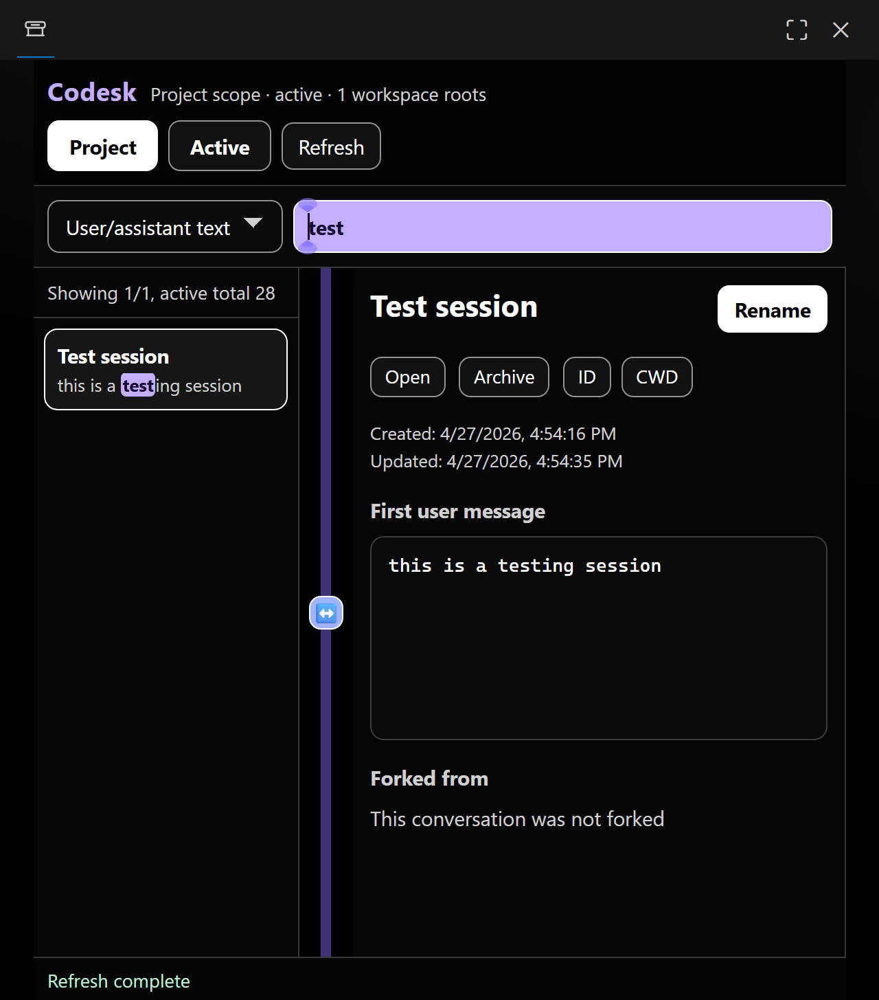

# Codesk

> A compact workspace for local Codex conversations inside VS Code.


Codesk is a standalone VS Code extension for browsing, searching, and managing local Codex conversations stored under `~/.codex`.



## Desk View

- Workspace-aware conversation list
- Active / archived switching
- Inline rename, archive, restore, and delete actions
- Split-pane detail view with resizable layout
- Fork-aware navigation between child and parent conversations
- Search across titles, metadata, and conversation text

## Workbench Features

### Desk surface: browsing

- Shows conversations created in the current workspace by default.
- Lets you switch the list scope between the current project and all tasks.
- Lets you switch between active and archived conversations.
- Opens conversation details in a split layout with a resizable divider.
- Lets you swap the left and right panes while keeping the divider centered.

### Desk search: discovery

- Supports searching by task title, session ID, CWD, first user message, or user/assistant conversation text.
- Highlights matched text in the list.
- Keeps parent-conversation jumps visible by scrolling the list toward the target conversation when possible.

### Desk actions: management

- Renames conversations directly inside the extension.
- Opens active conversations in the official Codex extension.
- Archives active conversations and restores archived conversations.
- Permanently deletes archived conversations from local storage.

### Desk links: forks

- Shows fork relationships, including the parent conversation name.
- Lets you jump from a forked conversation to its parent conversation.
- Shows both the inherited first user message and the first user message after the fork point when available.

## Under the Desk

Codesk reads local Codex data from:

- `~/.codex/state_5.sqlite`
- `~/.codex/session_index.jsonl`
- rollout files stored inside the Codex data directories

You can override the default Codex home path with a VS Code setting.

## Desk Settings

| Setting | Description |
| --- | --- |
| `codesk.codexHome` | Custom Codex data directory. Leave empty to use `~/.codex`. |
| `codesk.defaultScope` | Default list scope when opening the manager. Supported values: `project`, `all`. |

## Desk Setup

Run the syntax checks:

```powershell
npm run check
```

Test locally:

1. Open this folder in VS Code.
2. Press `F5` to launch an Extension Development Host window.

## Packing the Desk

Build a `.vsix` package:

```powershell
npm run package:vsix
```

The packaged extension is written to:

```text
dist/codesk-0.1.0.vsix
```

## Notes

- Codesk depends on the VS Code Extension Host runtime support for `node:sqlite`.
- Your system Node.js installation does not need to support `node:sqlite`, but the VS Code runtime does.
- Some actions, such as opening a conversation in the official Codex extension, require the official OpenAI Codex extension to be installed.
